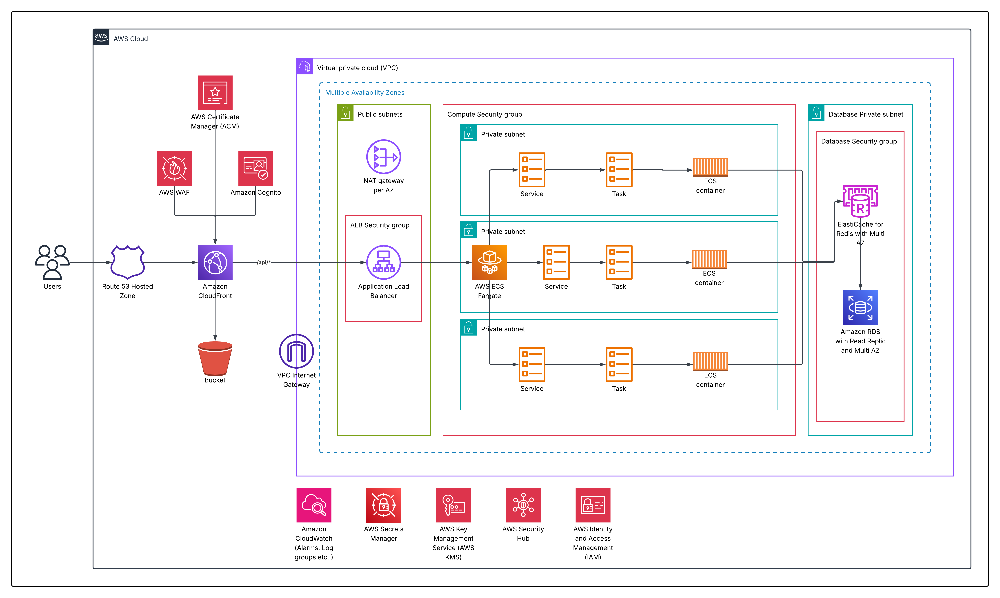

<div align="center">

# AWS Infrastructure for Containerized Applications with Terraform and CI/CD

[](https://www.terraform.io/)
[](https://registry.terraform.io/providers/hashicorp/aws/latest)
[](LICENSE)
[](https://github.com/22taran/terraform-aws-quickstart/stargazers)
[](https://github.com/22taran/terraform-aws-quickstart/network/members)

SPA on **S3 + CloudFront + WAF** &bull; API on **ECS Fargate** &bull; Database on **RDS** &bull; Auth via **Cognito** &bull; CloudWatch Monitoring &bull; Full **CI/CD Pipeline** via **CodePipeline + CodeBuild**
Source from **GitHub**, **Bitbucket**, or **GitLab** via **CodeStar Connections**

---

[Architecture](#architecture) &bull; [CI/CD Pipeline](#cicd-pipeline) &bull; [Quick Start](#quick-start) &bull; [Usage](#usage) &bull; [Modules](#modules-reference) &bull; [Toggles](#dev-vs-prod-toggles)

</div>

## Architecture

<div align="center">




</div>

**Flow:** Users &rarr; CloudFront (optional WAF) &rarr; S3 (static) &rarr; ALB (API) &rarr; ECS Fargate &rarr; RDS.
Cognito handles auth; CodeStar Connections (GitHub, Bitbucket, or GitLab) + CodeBuild/CodePipeline automate deployments.

---

## Why This Stack?

| Benefit | How This Stack Delivers It |
|--------|----------------------------|
| **High availability** | Multi-AZ VPC, ALB across 3 public subnets, ECS tasks in private subnets, optional Multi-AZ RDS |
| **Scalability** | ECS Fargate + optional CPU autoscaling, CloudFront edge caching, managed RDS |
| **Security** | Public/private/DB subnet isolation, SG per tier, WAF for CloudFront, Secrets Manager for DB credentials |
| **Cost control** | Toggles for dev vs prod: single vs per-AZ NAT, optional flow logs, ALB logs, WAF, alarms |
| **Operational simplicity** | Managed services (ECS Fargate, RDS, CloudFront), CloudWatch logs/alarms, SNS alerts |
| **Automation** | VCS (GitHub/Bitbucket/GitLab) &rarr; CodeStar Connections &rarr; CodeBuild/CodePipeline &rarr; ECR + ECS + S3 + CloudFront |

---

## Problems This Solves

| Problem | Solution |
|---------|----------|
| Downtime & single points of failure | Multi-AZ layout and optional Multi-AZ RDS reduce impact of AZ-level outages |
| Fluctuating traffic | ALB, ECS Fargate, CloudFront, and optional autoscaling handle load changes |
| Web vulnerabilities | Optional WAF protects CloudFront against common exploits |
| Manual ops | Managed compute, DB, CDN, and CI/CD reduce manual provisioning and patching |
| Insecure credentials | Secrets Manager holds DB password; ECS tasks pull it at runtime |
| Fragmented auth | Cognito provides sign-up/sign-in; frontend gets tokens, backend verifies them |

---

## What's Included

| Layer | Components | Key Services |
|-------|------------|--------------|
| **Edge** | CDN + Protection |   |
| **Static** | SPA Hosting |  |
| **Compute** | Load Balancing + Containers |   |
| **Data** | Database + Secrets |   |
| **Auth** | Identity |  |
| **CI/CD** | Build + Deploy |    |

---

## Repository Structure

```
terraform-aws-quickstart/
├── bootstrap/                      # One-time S3 for remote state (versioning, encryption)
│   ├── create-state-bucket.sh      # Creates state bucket (versioning, encryption)
│   ├── .env.example                # Copy to .env: project_name, environment, etc.
│   └── README.md
├── environments/
│   └── dev/                        # Dev environment
│       ├── main.tf                 # Wires all modules together
│       ├── variables.tf
│       ├── outputs.tf
│       ├── versions.tf             # Terraform + provider versions, backend
│       ├── provider.tf              # AWS provider config
│       ├── terraform.tfvars.example
│       └── terraform.tfvars         # Your values (create from example)
└── modules/                        # Reusable, composable modules
    ├── network/                    # VPC, subnets, NAT, flow logs
    ├── security_groups/            # ALB, ECS, RDS (terraform-aws-modules/security-group/aws)
    ├── alb/                        # Application Load Balancer
    ├── ecs/                        # ECS Fargate cluster + service
    ├── rds/                        # RDS + Secrets Manager
    ├── cognito/                    # User pool + app client
    ├── s3/                         # S3 bucket for SPA
    ├── cloudfront/                 # CDN with S3 + ALB origins
    ├── waf/                        # CloudFront WAF (us-east-1)
    ├── monitoring/                 # CloudWatch alarms + SNS
    ├── ecr/                        # Container registry
    ├── iam/                        # IAM roles and policies
    ├── codestar/                   # VCS connections
    ├── codebuild/                  # Build projects
    └── codepipeline/               # Deployment pipelines
```

---

## CI/CD Pipeline

The infrastructure provisions a complete, end-to-end CI/CD pipeline for both frontend and backend using AWS-native services.

### Pipeline Architecture

```
┌─────────────────────────────────────────────────────────────────────────┐
│                          SOURCE (VCS)                                   │
│   GitHub / Bitbucket / GitLab  ──►  CodeStar Connection                │
└──────────────────────────────┬──────────────────────────────────────────┘
                               │
              ┌────────────────┴────────────────┐
              ▼                                 ▼
┌──────────────────────────┐     ┌──────────────────────────────────────┐
│     FRONTEND PIPELINE    │     │         BACKEND PIPELINE             │
│                          │     │                                      │
│  CodeBuild               │     │  CodePipeline                        │
│    ├─ npm install        │     │    │                                 │
│    ├─ npm run build      │     │    ├─ Source ──► CodeStar            │
│    └─ Sync to S3         │     │    ├─ Build  ──► CodeBuild (Docker)  │
│                          │     │    └─ Deploy ──► ECS (Rolling)       │
│  Post-build:             │     │                                      │
│    └─ CloudFront         │     │  Build steps:                        │
│       invalidation       │     │    ├─ Docker build                   │
│                          │     │    ├─ Push to ECR                    │
│                          │     │    └─ Generate imagedefinitions.json  │
└──────────────────────────┘     └──────────────────────────────────────┘
              │                                 │
              ▼                                 ▼
┌──────────────────────────┐     ┌──────────────────────────────────────┐
│   S3  ──►  CloudFront    │     │   ECR  ──►  ECS Fargate (Fargate)   │
│   (Static SPA)           │     │   (Containerized API)               │
└──────────────────────────┘     └──────────────────────────────────────┘
```

### How It Works

| Stage | Frontend | Backend |
|-------|----------|---------|
| **Source** | CodeStar pulls from VCS repo | CodePipeline Source stage via CodeStar |
| **Build** | CodeBuild runs `npm install` + `npm run build` | CodeBuild builds Docker image, pushes to ECR |
| **Deploy** | Artifacts synced to S3, CloudFront cache invalidated | CodePipeline Deploy stage updates ECS service (rolling) |
| **Result** | SPA served globally via CloudFront | API containers running on ECS Fargate behind ALB |

### Supported VCS Providers

| Provider | Connection |
|----------|------------|
|  | Via CodeStar Connection |
|  | Via CodeStar Connection |
|  | Via CodeStar Connection |

> **Note:** After `terraform apply`, you must manually approve the CodeStar Connection in the AWS Console to authorize access to your VCS provider.

---

## Sample App: Atom Logistic

The stack deploys a sample logistics app (frontend SPA + backend API) using the CI/CD pipeline above.

Configure `frontend_repository_url` and `backend_repository_url` in `terraform.tfvars`.
See [environments/dev/terraform.tfvars.example](environments/dev/terraform.tfvars.example) for all options.

---

## Quick Start

### Prerequisites

| Tool | Version |
|------|---------|
|  | `>= 1.10.0` |
|  | Credentials configured |
|  | Frontend & backend repos on GitHub, Bitbucket, or GitLab |

### Steps

**0. Bootstrap (one-time)** — If using S3 remote state and the bucket doesn’t exist:

```bash
cd bootstrap && cp .env.example .env
# Edit .env: PROJECT_NAME, ENVIRONMENT, AWS_REGION (must match terraform.tfvars)
./create-state-bucket.sh   # Uses S3 locking by default (versioning + use_lockfile)
# Add -k for KMS encryption; -d for DynamoDB (only for team/concurrent runs)
```

Copy the printed backend block into `environments/dev/versions.tf`. See [bootstrap/README.md](bootstrap/README.md).

**1. Configure**

```bash
cd environments/dev
cp terraform.tfvars.example terraform.tfvars
# Edit: project_name, db_name, db_username, frontend_repository_url, backend_repository_url
```

**2. Deploy**

```bash
terraform init
terraform plan
terraform apply
```

**3. Connect VCS** — Complete the CodeStar Connections setup in the AWS Console so pipelines can access your repos.

**4. Access**

```bash
terraform output cloudfront_url
# Open the URL in your browser
```

---

## Usage

### Bootstrap (S3 state backend)

```bash
cd bootstrap
cp .env.example .env
# Edit .env: PROJECT_NAME, ENVIRONMENT, AWS_REGION (must match terraform.tfvars)
./create-state-bucket.sh          # Default: S3 locking (versioning + use_lockfile)
./create-state-bucket.sh -k      # With KMS encryption
./create-state-bucket.sh -d      # With DynamoDB for team locking (only for concurrent runs)
./create-state-bucket.sh -r us-west-2
```

**Note:** By default, state locking uses S3 (versioning + `use_lockfile`). Use `-d` only when multiple people run Terraform concurrently and need DynamoDB-based locking.

Copy the printed backend block into `environments/dev/versions.tf`. See [bootstrap/README.md](bootstrap/README.md).

### Terraform workflow

```bash
cd environments/dev
terraform init
terraform plan
terraform apply
terraform output cloudfront_url
```

### Environment variables

| Source | Purpose |
|--------|---------|
| `bootstrap/.env` | PROJECT_NAME, ENVIRONMENT, AWS_REGION for state bucket |
| `environments/dev/terraform.tfvars` | project_name, db_*, repos, toggles |

Keep `PROJECT_NAME` and `ENVIRONMENT` in sync between `bootstrap/.env` and `terraform.tfvars`.

---

## Dev vs Prod Toggles

| Variable | Dev | Prod | Purpose |
|----------|:---:|:----:|---------|
| `enable_waf` | `false` | `true` | Web Application Firewall |
| `rds_multi_az` | `false` | `true` | Database high availability |
| `ecs_enable_autoscaling` | `false` | `true` | Container autoscaling |
| `enable_flow_logs` | `false` | `true` | VPC traffic logging |
| `enable_alb_access_logs` | `false` | `true` | Load balancer logging |
| `enable_cloudwatch_alarms` | `false` | `true` | Operational alerting |
| `force_destroy` | `true` | `false` | Allow resource deletion |
| `single_nat_gateway` | `true` | `false` | One NAT per AZ for HA |

All toggles are documented in [environments/dev/terraform.tfvars.example](environments/dev/terraform.tfvars.example).

---

## Modules Reference

| Module | Purpose | Links |
|--------|---------|-------|
| **network** | VPC, public/private/DB subnets, NAT, flow logs | [README](modules/network/README.md) |
| **security_groups** | ALB, ECS, RDS security groups (uses terraform-aws-modules/security-group/aws) | [README](modules/security_groups/README.md) |
| **rds** | RDS + Secrets Manager | [README](modules/rds/README.md) |
| **ecs** | ECS Fargate cluster + service | [README](modules/ecs/README.md) |
| **alb** | Application Load Balancer | [README](modules/alb/README.md) |
| **cloudfront** | CDN with S3 + ALB origins | [README](modules/cloudfront/README.md) |
| **cognito** | User pool + app client | [README](modules/cognito/README.md) |
| **waf** | CloudFront WAF (us-east-1) | [README](modules/waf/README.md) |
| **monitoring** | CloudWatch alarms + SNS | [README](modules/monitoring/README.md) |
| **s3** | S3 bucket for SPA | [README](modules/s3/README.md) |
| **ecr** | Elastic Container Registry | [README](modules/ecr/README.md) |
| **iam** | IAM roles and policies | [README](modules/iam/README.md) |
| **codestar** | VCS connections | [README](modules/codestar/README.md) |
| **codebuild** | Build projects | [README](modules/codebuild/README.md) |
| **codepipeline** | Deployment pipelines | [README](modules/codepipeline/README.md) |

Each module has its own README with inputs/outputs.

---

## Cleanup

```bash
terraform destroy
```

> **Note:** If `force_destroy = false`, you must empty S3 buckets and ECR repos manually before destroying.

---

<div align="center">

**Built with Terraform on AWS**

[](https://www.terraform.io/)
[](https://aws.amazon.com/)

MIT License &copy; 2026 [Tarandeep Singh](https://github.com/22taran)

</div>
